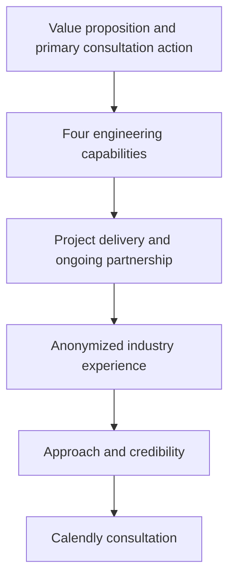
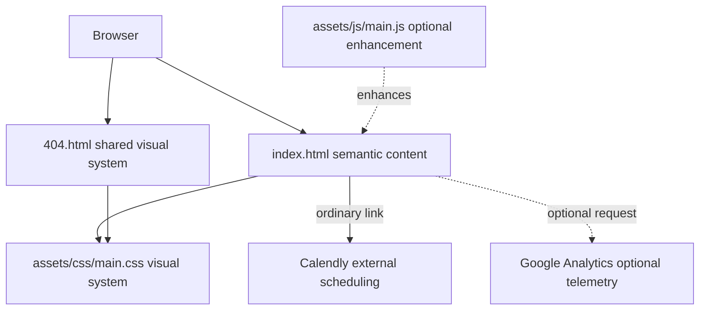
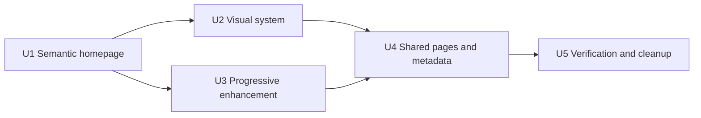

# TopRank Futuristic Homepage - Plan

## Goal Capsule

- **Objective:** Replace the current TopRank Digital Solutions homepage with a focused one-page experience that earns trust for cybersecurity, custom software, applied AI, and cloud engineering services and converts qualified visitors into scheduled consultations.
- **Product authority:** This plan defines the first-release homepage positioning, visual direction, content boundaries, and visitor journey. Dedicated service pages and additional contact channels are later work.
- **Open blockers:** None.
- **Execution profile:** Implement as a framework-free static GitHub Pages release with smoke-first verification.
- **Stop conditions:** Stop if implementation requires naming a prior organization, inventing a credential or result, changing the custom domain, or introducing a build framework.
- **Tail ownership:** The implementing workflow owns shared-page regression checks, local browser verification, cleanup of retired template assets, and deployment-ready handoff.

---

## Product Contract

### Summary

TopRank Digital Solutions will present itself as a modern technology engineering partner through a simple, premium, blue-neon homepage. The page will support both defined project delivery and ongoing technical partnerships while leading interested visitors to Calendly.

### Problem Frame

The existing homepage lists a broad mix of capabilities but does not establish a distinctive brand, a clear technical position, or a concise path from visitor need to consultation. Its legacy visual design undersells the depth of experience behind the company and gives equal weight to services that appeal to different buyers.

The new homepage needs to feel technically credible without becoming a noisy science-fiction interface. It must also communicate relevant experience without naming clients, displaying client logos, or implying direct contractual relationships that did not exist.

### Key Decisions

- **Lead as a technology engineering partner.** Cybersecurity, software development, applied AI, and cloud engineering define the primary offer. Governs R1-R4. (session-settled: user-approved — chosen over retaining digital marketing and lead generation as equal homepage pillars: the technical services form the strongest and most coherent position.)
- **Use a restrained command-center identity.** Combine Quiet Orbit's spacious premium composition with Blue Command's grid, technical labeling, and cyan illumination. Governs R5-R7. (session-settled: user-directed — chosen over either visual concept alone: the mix preserves simplicity while delivering the requested futuristic character.)
- **Launch with one focused page.** Dedicated service pages are deferred until each can carry enough proof and substance to justify its own page. Governs R8-R10. (session-settled: user-approved — chosen over an immediate multi-page site: a complete focused homepage creates value sooner and avoids thin content.)
- **Keep all experience anonymous.** Refer to industries, problems, contributions, and outcomes without names or logos. Governs R11-R13. (session-settled: user-directed — chosen over selectively naming recognizable organizations: the user does not want any prior client or organization named.)
- **Make Calendly the only launch conversion path.** Email can be added later without blocking release. Governs R14-R15. (session-settled: user-directed — chosen over launching with multiple contact methods: Calendly is the user's preferred call to action.)

### Requirements

**Positioning and services**

- R1. The homepage must position TopRank Digital Solutions as a technology engineering partner rather than a general digital-marketing agency.
- R2. The primary service presentation must cover cybersecurity, custom software development, applied AI, and cloud engineering.
- R3. The service language must explain business value in accessible terms while retaining enough technical specificity to earn credibility with technical evaluators.
- R4. The homepage must make both defined project delivery and ongoing embedded partnership recognizable engagement options.

**Visual identity and experience**

- R5. The experience must use a near-black or midnight-navy foundation with electric cyan and blue as controlled highlights.
- R6. The visual system must combine spacious premium composition with restrained command-center motifs such as a subtle grid, technical labels, thin luminous borders, or an orbital focal element.
- R7. Neon effects must direct attention and establish atmosphere without reducing readability, overwhelming content, or making the company appear theatrical.

**Homepage structure and narrative**

- R8. The first release must be a complete one-page website with clear navigation among its major sections.
- R9. The page must move from a concise value proposition through services, engagement model, anonymized experience, trust-building content, and a consultation call to action.
- R10. Calls to schedule a consultation must appear at the moments where a visitor is most likely to have enough context to act.

**Experience and trust**

- R11. The homepage must describe relevant work through anonymized examples from legal technology, healthcare startups, large-scale e-commerce, and political technology.
- R12. Experience statements must distinguish personal or team experience from direct TopRank client relationships and must not overstate the company's role.
- R13. No past client, organization, or project may be named or represented by a recognizable logo.

**Conversion**

- R14. Calendly must be the primary and only required contact path for the first release.
- R15. The consultation experience must make the next step clear without forcing visitors to disclose project details publicly or navigate away without context.

**Quality**

- R16. The homepage must remain coherent, readable, and usable on mobile, tablet, and desktop screen sizes.
- R17. Motion, glow, and decorative effects must respect accessibility needs and must not prevent visitors from understanding or navigating the page.
- R18. Page metadata and visible copy must consistently reflect the four primary technical capabilities and the consultation goal.
- R19. Navigation and every consultation link must remain functional when JavaScript or third-party resources are unavailable.
- R20. Decorative neon layers must remain non-semantic, non-interactive, and unable to create horizontal overflow or obscure content.
- R21. The shared 404 page must remain readable, branded, responsive, and able to return visitors to the homepage.
- R22. Visible copy, metadata, structured data, alternative text, and production comments must contain no identifiable prior organization or unsupported claim.

### Actors

- A1. **Business decision-maker:** Evaluates whether TopRank can reduce risk or deliver a technical initiative and needs understandable evidence of capability.
- A2. **Technical evaluator:** Looks for credible technical depth across security, software, AI, and cloud before recommending contact.
- A3. **Prospective partner:** Seeks either a defined delivery engagement or ongoing technical capacity.

### Key Flows

- F1. Discover and understand the offer
  - **Trigger:** A1, A2, or A3 arrives on the homepage.
  - **Actors:** A1, A2, A3.
  - **Steps:** The visitor reads the core promise, scans the four capabilities, and identifies an engagement model matching their need.
  - **Outcome:** The visitor understands what TopRank does and whether the company could be relevant.
  - **Covered by:** R1-R9.
- F2. Validate credibility
  - **Trigger:** A visitor wants evidence before making contact.
  - **Actors:** A1, A2, A3.
  - **Steps:** The visitor reviews anonymized industry experience and the company's working approach without encountering unverifiable client claims.
  - **Outcome:** The visitor gains confidence while all confidentiality boundaries remain intact.
  - **Covered by:** R11-R13.
- F3. Schedule a consultation
  - **Trigger:** A visitor decides that TopRank may fit their project or partnership need.
  - **Actors:** A1, A2, A3.
  - **Steps:** The visitor selects a consultation call to action and chooses an available Calendly time.
  - **Outcome:** A qualified conversation is scheduled through the single launch contact path.
  - **Covered by:** R10, R14, R15.

### Acceptance Examples

- AE1. Clear technical position
  - **Covers:** R1-R4.
  - **Given:** A new visitor reaches the homepage without prior knowledge of TopRank.
  - **When:** They scan the hero and primary service content.
  - **Then:** They can identify cybersecurity, software, AI, and cloud as the four core capabilities and understand that TopRank supports both projects and ongoing partnerships.
- AE2. Restrained futuristic identity
  - **Covers:** R5-R7, R16, R17.
  - **Given:** A visitor views the site on a supported screen size or with reduced-motion preferences.
  - **When:** The page renders its grid, glow, orbital, and motion treatments.
  - **Then:** Content remains readable and navigable while the interface still feels premium, blue-neon, and futuristic.
- AE3. Anonymous credibility
  - **Covers:** R11-R13.
  - **Given:** A visitor reviews the experience section.
  - **When:** They read an example based on prior work.
  - **Then:** The example communicates the industry, challenge, contribution, and relevant capability without exposing or implying a client identity.
- AE4. Consultation conversion
  - **Covers:** R10, R14, R15.
  - **Given:** A visitor is ready to discuss either a project or an ongoing partnership.
  - **When:** They use a consultation call to action.
  - **Then:** They reach the Calendly scheduling experience with a clear understanding of what the consultation is for.
- AE5. Progressive enhancement
  - **Covers:** R8-R10, R14, R15, R19.
  - **Given:** JavaScript is disabled or third-party requests are blocked.
  - **When:** A visitor navigates the homepage and selects any consultation action.
  - **Then:** Every section remains reachable and the ordinary Calendly link remains usable.
- AE6. Shared-page regression
  - **Covers:** R16-R18, R21.
  - **Given:** A visitor opens an unknown route on the custom domain.
  - **When:** GitHub Pages serves the fallback page.
  - **Then:** The page is readable on mobile and desktop and provides a functional route to the homepage.

### Success Criteria

- A first-time visitor can accurately describe TopRank's four primary capabilities after scanning the homepage.
- The visual identity is recognizably futuristic and blue-neon without sacrificing premium simplicity or content legibility.
- Anonymized experience adds credibility without revealing or implying the identity of any prior organization.
- A qualified visitor can move from any major decision point to scheduling a consultation with minimal friction.

### Scope Boundaries

**Deferred for later**

- Dedicated service pages with deeper proof, processes, and service-specific calls to action.
- An email inquiry channel.
- A finalized permanent logo if the current test marks are not yet ready.
- Additional proof such as named testimonials, client logos, or published case studies if permission and suitable material become available.

**Outside this product's identity**

- Presenting digital marketing or lead generation as equal homepage pillars alongside the four engineering capabilities.
- A dense, theatrical science-fiction interface that prioritizes visual effects over trust and comprehension.
- Naming or visually identifying prior clients, organizations, or confidential engagements.

### Dependencies and Assumptions

- The existing Calendly destination remains available for consultation scheduling.
- A text-based TopRank wordmark can serve as the launch identity while the permanent logo remains unresolved.
- Existing experience can be summarized accurately at the industry and contribution level without additional disclosure approval.
- The existing static GitHub Pages delivery model remains suitable for the first release.

### Sources and Research

- The current homepage content and conversion path are in `index.html`.
- Existing visual styling is concentrated in `assets/css/main.css` and `assets/sass/main.scss`.

### Product Contract Preservation

Product Contract extended without scope change: R19-R22 and AE5-AE6 make the confirmed progressive-enhancement, decorative-safety, 404, and anonymous-copy release boundaries explicit.

---

## Planning Contract

### Key Technical Decisions

- KTD1. **Keep a static, zero-build architecture.** Use semantic HTML and directly maintained CSS within the existing GitHub Pages deployment. Do not add a frontend framework or package-managed build pipeline. Governs U1-U5.
- KTD2. **Retire the coupled HTML5 UP interaction stack.** Replace jQuery, Dropotron, Scrolly, breakpoint helpers, and generated mobile panels with native document behavior and progressive enhancement. Governs U1, U3. (session-settled: user-approved — chosen over retaining the legacy template stack: the confirmed scope favors a simpler framework-free implementation.)
- KTD3. **Use CSS-led futuristic decoration.** Build the grid, glow, orbit, borders, and restrained motion from CSS gradients, pseudo-elements, and optional inline decorative SVG. Do not add video, canvas, WebGL, or bitmap dependencies. Governs U2. (session-settled: user-approved — chosen over implementing either visual probe literally: the user selected a restrained mix of both directions.)
- KTD4. **Use ordinary Calendly links as the conversion source of truth.** Remove the large inline widget and point each consultation action to the existing HTTPS scheduling destination. Any enhancement must preserve the link. Governs U1, U3. (session-settled: user-approved — chosen over retaining the embedded calendar: the link approach preserves conversion when scripts are blocked and keeps the page simple.)
- KTD5. **Treat all published text surfaces as disclosure-sensitive.** Validate visible copy, metadata, JSON-LD, alternative text, and production comments against R22 before release. Governs U1, U4, U5.
- KTD6. **Maintain CSS as the only active style source.** Replace `assets/css/main.css` directly and retire the unused Sass source so the repository does not retain divergent style authorities. Governs U2, U5.

### High-Level Technical Design

The design is directional. It defines component relationships and progressive-enhancement boundaries, not exact implementation syntax.

The semantic HTML owns the entire narrative, navigation, and consultation journey. CSS owns layout and atmosphere. JavaScript may enhance presentation or navigation state, but it must not own access to content or conversion.

### Implementation Constraints

- Preserve `CNAME` and `robots.txt` unless implementation discovers a necessary URL correction.
- Preserve the Google Analytics property unless the user separately requests analytics removal.
- Use a single descriptive page-level heading, semantic landmarks, native links, a skip link, and ordered headings.
- Remove `user-scalable=no` from both viewport declarations.
- Keep decorative layers out of the accessibility tree and pointer flow.
- Provide visible `:focus-visible` treatment, WCAG AA text and interactive-state contrast, reduced-motion fallbacks, and forced-color resilience.
- Keep the complete narrative and all consultation actions useful when JavaScript, analytics, fonts, or Calendly resources fail.

### Sequencing

U1 establishes the content and DOM contract. U2 and U3 can then proceed independently. U4 aligns shared pages and crawl surfaces after the common visual and navigation behavior settles. U5 verifies the integrated release and removes only assets proven unused.

### Risks and Dependencies

- Replacing `assets/css/main.css` can regress `404.html` because both pages share it.
- Keeping `assets/js/main.js` without replacing its jQuery assumptions will cause runtime errors when legacy scripts are removed.
- Calendly and Google Analytics are third-party dependencies. Their failure must not block core content or the scheduling link.
- Unsupported metrics, certifications, client implications, or organization names can survive in metadata after visible copy changes unless all surfaces are reviewed together.
- The existing test-logo state is not a blocker because the text wordmark remains the launch fallback.

### Sources and Research

- `index.html` owns homepage content, SEO and social metadata, analytics, Calendly, and Organization JSON-LD.
- `404.html` consumes the same global stylesheet and legacy scripts as the homepage.
- `assets/js/main.js` depends on jQuery and a `#nav` contract to generate mobile navigation.
- `assets/sass/main.scss` and `assets/css/main.css` reflect the current HTML5 UP template, but the repository has no reproducible Sass toolchain.
- [Broadwing homepage](https://www.broadwing.io/) informed the outcome-led page rhythm, proof placement, and consultation journey without supplying copy or visual assets.
- [Broadwing work](https://www.broadwing.io/work/) informed challenge/contribution/result proof framing and the acceptability of withheld organization names.

---

## Implementation Units

### U1. Rebuild the semantic homepage narrative

- **Goal:** Replace the legacy homepage markup and copy with the complete one-page visitor journey.
- **Requirements:** R1-R4, R8-R15, R18, R19, R22; F1-F3; AE1, AE3-AE5.
- **Files:** `index.html`, `tests/site-smoke.sh`.
- **Approach:** Create semantic header, main, section, and footer landmarks with native section links. Build an outcome-led hero, four problem/intervention/outcome service cards, project and partnership paths, a concise working approach, anonymous experience cards, consultation expectations, and repeated ordinary Calendly links. Update title, description, canonical, social metadata, and JSON-LD in the same unit. Keep every experience statement framed as industry or prior team experience.
- **Dependencies:** None.
- **Execution note:** Establish the repeatable content and metadata smoke checks before styling changes obscure copy regressions.
- **Test scenarios:**
  - A first-time visitor can identify all four primary services from the hero and service region.
  - Project delivery and ongoing partnership are both visible without competing calls to action.
  - Each consultation action resolves to the same HTTPS Calendly destination and has meaningful link text.
  - Section links reach the intended headings with JavaScript disabled.
  - Visible copy, metadata, JSON-LD, alternative text, and comments contain no forbidden organization names or unsupported claims.
  - JSON-LD parses and contains no address, rating, client, credential, or service claim absent from the Product Contract.
- **Verification:** Run the site smoke checks, inspect the semantic outline, and complete F1-F3 with JavaScript disabled.

### U2. Build the restrained blue-neon visual system

- **Goal:** Implement the mixed Quiet Orbit and Blue Command direction across responsive layouts without weakening readability.
- **Requirements:** R5-R7, R16, R17, R20; AE2.
- **Files:** `assets/css/main.css`, `index.html`, `404.html`.
- **Approach:** Define color, type, spacing, radius, border, glow, and motion tokens. Build the grid, orbital focal element, technical labels, cards, navigation, and consultation surfaces from CSS-native decoration. Use resilient layout primitives and keep all decoration non-interactive. Apply matching core typography and surface rules to the fallback page.
- **Dependencies:** U1.
- **Test scenarios:**
  - The page has no clipped text, overlap, or horizontal scrolling at 320px, landscape mobile, tablet, desktop, and wide desktop sizes.
  - Content remains readable at 200% zoom and with longer service or experience copy.
  - Reduced-motion users receive no nonessential animation or smooth scrolling.
  - Forced colors and high-contrast settings retain content hierarchy and visible interactive states.
  - Missing decorative layers do not remove information or block pointer events.
  - Normal text and interactive states meet WCAG AA contrast.
- **Verification:** Inspect each target viewport, keyboard focus state, reduced-motion state, forced-color state, and 200% zoom behavior.

### U3. Replace legacy navigation with progressive enhancement

- **Goal:** Remove the jQuery-dependent interaction path while preserving functional native navigation.
- **Requirements:** R8-R10, R16, R17, R19; F1, F3; AE2, AE4, AE5.
- **Files:** `index.html`, `assets/js/main.js`, `tests/site-smoke.sh`.
- **Approach:** Make native anchors and responsive wrapping the baseline. Keep `assets/js/main.js` only for small enhancements that preserve the static document contract, such as navigation-state styling. Remove legacy script tags after all retained behavior is independent of them.
- **Dependencies:** U1.
- **Test scenarios:**
  - Every navigation item and consultation action works with JavaScript disabled.
  - Keyboard traversal follows document order and always shows focus.
  - Hash navigation does not hide section headings beneath any sticky header.
  - JavaScript-enabled behavior produces no console errors or duplicate controls.
  - Blocking analytics and Calendly resources does not break navigation or page comprehension.
- **Verification:** Compare JavaScript-enabled and disabled behavior at narrow and wide viewports and confirm zero runtime errors.

### U4. Align shared pages and crawl surfaces

- **Goal:** Keep the 404 experience, metadata, and crawl files consistent with the redesigned homepage.
- **Requirements:** R16-R18, R21, R22; AE6.
- **Files:** `404.html`, `sitemap.xml`, `robots.txt`, `CNAME`, `tests/site-smoke.sh`.
- **Approach:** Rebuild the fallback markup on the shared semantic and visual conventions. Give the page accurate no-index-friendly metadata and a reliable homepage link. Update the sitemap homepage modification date for the release while preserving the custom-domain and robots contracts.
- **Dependencies:** U2, U3.
- **Test scenarios:**
  - An unknown route renders a readable branded fallback on mobile and desktop.
  - The fallback works without JavaScript and returns to the homepage.
  - Homepage and fallback metadata are accurate and do not misrepresent the missing URL.
  - `CNAME` and `robots.txt` retain their existing valid custom-domain values.
  - `sitemap.xml` retains the homepage entry and reflects the release date.
- **Verification:** Serve an unknown local route with fallback behavior, inspect both page heads, and compare protected deployment files.

### U5. Verify the integrated release and retire dead assets

- **Goal:** Prove the static release across content, accessibility, responsiveness, third-party failure, and deployment integrity, then remove obsolete template assets.
- **Requirements:** R1-R22; F1-F3; AE1-AE6.
- **Files:** `tests/site-smoke.sh`, `README.txt`, `assets/sass/main.scss`, `assets/js/`, `assets/webfonts/`, `assets/css/fontawesome-all.min.css`, `images/`.
- **Approach:** Expand smoke checks to cover disclosure, required sections, Calendly URL consistency, metadata, and removed-resource references. Run local browser verification before deleting assets. Remove only legacy files that have no remaining HTML, CSS, or JavaScript references. Update licensing notes if no HTML5 UP code remains.
- **Dependencies:** U4.
- **Test scenarios:**
  - Smoke checks pass for required sections, all conversion links, metadata, and forbidden-name patterns.
  - The browser makes no requests for retired jQuery plugins, fonts, styles, scripts, or images.
  - Homepage and fallback page show no console errors, broken links, or missing first-party resources.
  - Core content and conversion remain usable with JavaScript disabled and third-party requests blocked.
  - Keyboard-only users can complete discovery, credibility review, and consultation flows.
  - The repository contains no dead production references to removed assets or divergent Sass source.
- **Verification:** Complete every Verification Contract gate and inspect the final diff for abandoned experiments or stale template code.

---

## Verification Contract

### Automated and Static Gates

- Run `tests/site-smoke.sh` to verify required section IDs, consistent Calendly destinations, metadata presence, disclosure-sensitive text, and absence of retired production references.
- Validate `index.html` and `404.html` with an HTML5-aware validator. Review tool warnings around JSON-LD rather than suppressing them blindly.
- Parse the Organization JSON-LD and confirm valid JSON plus the approved service vocabulary.
- Check all first-party links and referenced assets while serving the repository over HTTP.

### Browser Gates

- Serve the repository as a static site and test 320px mobile, landscape mobile, tablet, desktop, and wide desktop layouts.
- Verify 200% zoom, keyboard-only traversal, skip-link behavior, heading order, focus visibility, forced colors, reduced motion, and WCAG AA contrast.
- Repeat the primary visitor flows with JavaScript disabled and with Calendly, analytics, and font requests blocked.
- Verify section hashes, sticky-header offsets, every consultation link, and unknown-route fallback behavior.
- Confirm no horizontal overflow, clipped glow, overlapping decoration, console errors, or missing first-party resources.

### Content and Deployment Gates

- Search all shipped text surfaces for organization names, identifiable project details, unsupported metrics, testimonials, certifications, and direct-client implications.
- Confirm title, description, canonical, Open Graph, Twitter, and JSON-LD fields agree with the visible technical positioning.
- Preserve `CNAME` and `robots.txt` unless a necessary correction is documented.
- Confirm `sitemap.xml` contains the canonical homepage and the actual release modification date.

---

## Definition of Done

- U1-U5 satisfy their cited requirements and test scenarios in dependency order.
- The Product Contract remains the authority for positioning, disclosure, visual restraint, and conversion behavior.
- The homepage communicates the four primary capabilities, both engagement models, anonymous experience, and the Calendly next step without JavaScript.
- The blue-neon design remains readable and usable across target viewports, accessibility modes, and 200% zoom.
- The fallback page, metadata, structured data, custom-domain files, and sitemap pass their release gates.
- No prior organization is identifiable and no unsupported metric, certification, testimonial, or direct-client implication ships.
- No production page requests a retired legacy asset or throws a console error.
- The repeatable smoke checks and all browser gates pass.
- Dead-end experiments, obsolete template code, unused assets, and divergent style sources introduced or exposed by the work are removed from the final diff.
